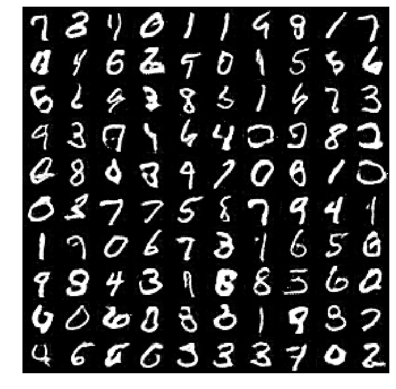
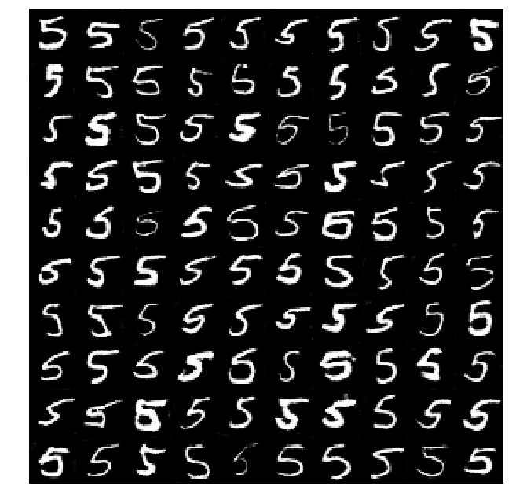
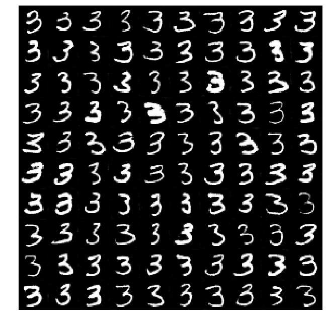
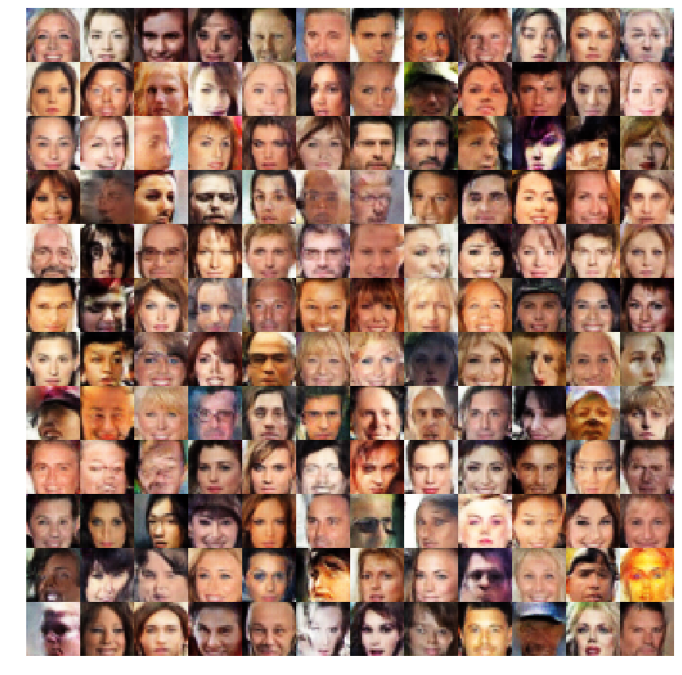

# Face Generation

Submission for Udacity's Face Generation project is zipped. For convenience, it can be downloaded from [submission.zip](submission.zip).

The other files included in this repository are additional work done. Three different models are included:

1. MNIST: deeper network with more training epochs (mnist_gan.py).
2. MNIST with label: added a label to the random noise input. The model can generate a specific digit (mnist_gan_with_labels.py).
3. Face: deeper network with more training epochs  (face_gan.py).

Sample results and code for those models are provided below. Finally, instructions on how to train the face generation model on a AWS deep learning instance are included.

## MNIST

To generate 100 random samples:

```
samples = n.generate(100, 'output/mnist_gan.ckpt')
```



## MNIST with label 

To generate 100 samples of the digit 5:

```
samples = n.inference([5 for i in range(100)], 'output/mnist_gan_label.ckpt')
```



Similarly, to generate samples for the digit 3:

```
samples = n.inference([3 for i in range(100)], 'output/mnist_gan_label.ckpt')
```



## Face 



## Run on AWS

Clone the repository and cd in directory.

```
git clone https://github.com/O1SA/face-generation.git
cd face-generation
```

Install requirements using pip.

```
pip install -r req-gpu.txt
```

Run the setup script. It will automatically download the celeba dataset and create the needed folder structure. 

```
python face_gan.py --setup
```

Train the network. For example, to run one epoch and save a checkpoint once training is completed:

```
python face_gan.py --train --save --epochs 1
```

To restore a checkpoint before training use the `--restore` option:

```
python face_gan.py --train --save --epochs 2 --restore output/face_gan.ckpt 
```

The table below summarizes the different options that can be used as well as their default values.

Option | Default | Description
------------ | ------------- | -------------
--train | False | Train the model
--setup | False | Run the required setup before training
--save | False | Save a checkpoint once training is completed
--epochs | 2 | Number of epochs to train for
--batch_size | 32 | Batch size
--z_dim | 100 | Input noise dimension
--lrate | 0.0004 | Adam optimizer learning rate 
--beta1 | 0.6 | Adam optimizer beta1
--alpha | 0.2 | Leaky ReLu alpha
--loss_each | 10 | Log loss each number of iterations
--image_each | 100 | Log sample image each number of iterations
--log_dir | log/face | Relative path to the TensorBoard folder
--in_dir | data/face | Relative path to the celeba dataset
--out_dir | output | Relative path to the output folder 
--restore | None | If provided will restore a checkpoint before training